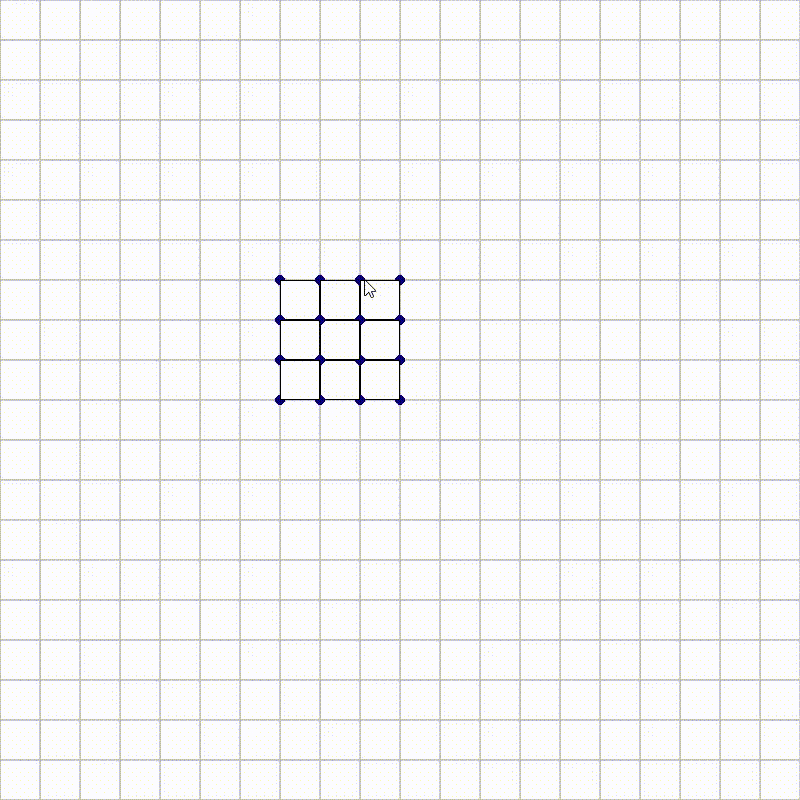

# MIT_ElectroVoxel

## Overview
MIT_ElectroVoxel is a simulation project developed based the subject of a internship at the European Space Agency's Advanced Concepts Team (ESA ACT). This project focuses on simulating electrovoxels, a novel concept emerging from MIT's CSAIL. The simulation aims to replicate the dynamic behaviors of electrovoxels in a 2D environment and includes an interactive interface for shape creation using electrovoxels.

The final objective is to use reinforcement learning to makes electrovoxels go to shape A to B.

## Features

### Electrovoxel Movement Simulation
- The `draft` folder contains the initial version of the electrovoxel environment.
- This environment encapsulates all the movements of electrovoxels, as showcased in the gif.

### Interactive Interface
- An interactive interface is included to facilitate the creation of shapes using electrovoxels.
- The interface can be viewed in the image.

### Rule Implementation
- A specific rule has been implemented to prevent the saving of shapes that consist of multiple, separate groups of electrovoxels.
- This rule is illustrated in the following image.

### Shape Import Functionality
- Within the `draft` directory, it is possible to import saved shapes in CSV format for display purposes (accessible only through code).

### Development of New Environment
- Work is underway in the `electrovoxel` directory to recreate the environment following the OpenAI framework.
- The development is inspired by OpenAI's gym, particularly the Frozen Lake example: [Frozen Lake Environment Source Code](https://github.com/openai/gym/blob/master/gym/envs/toy_text/frozen_lake.py#L185).

Certainly! Here's a TO-DO list in English, formatted for a GitHub README. This list outlines the key steps for developing and testing your electrovoxel environment using reinforcement learning models:

## TO-DO List for Electrovoxel Environment Development

### Environment Setup and Testing
- [ ] **Finalize the Environment Setup**  
  Complete the development of the electrovoxel environment, ensuring it is fully integrated with the Gym/Gymnasium library. This involves finalizing the environment's structure, observation and action spaces, and reward mechanisms.

- [ ] **Test with Basic Reinforcement Learning Models**  
  Implement and test simple reinforcement learning models such as Q-Learning (QL) and Deep Q-Learning (DQL). The goal is to validate the environment's functionality and its ability to interact effectively with these models.

### Research and Model Optimization
- Once the environment is confirmed to be testable with basic models, the focus will shift to more extensive research and the optimization of reinforcement learning models for better performance and efficiency in the electrovoxel simulation.

### Environment Enhancement Ideas
- [ ] **Implement Multi-threading**  
  Enable simultaneous actions for multiple electrovoxels under certain conditions, enhancing the environment's dynamism and realism.

- [ ] **Include ANSI Display**  
  Incorporate an ANSI display for a more interactive and visually appealing representation of the environment and electrovoxel interactions.

- [ ] **Ensure Full Functionality**  
  Continuously test and debug the environment to guarantee its smooth operation and compatibility with various reinforcement learning models.

