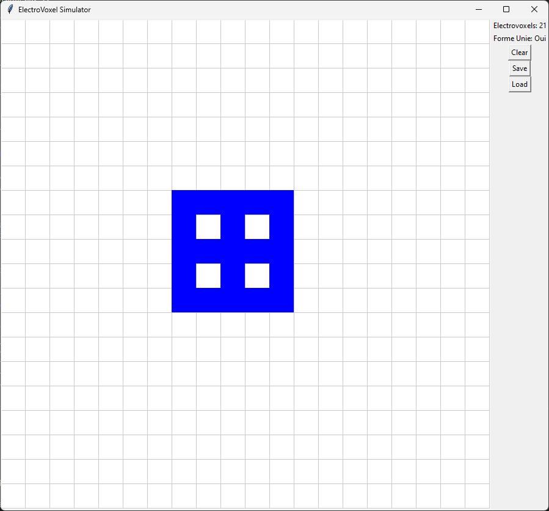
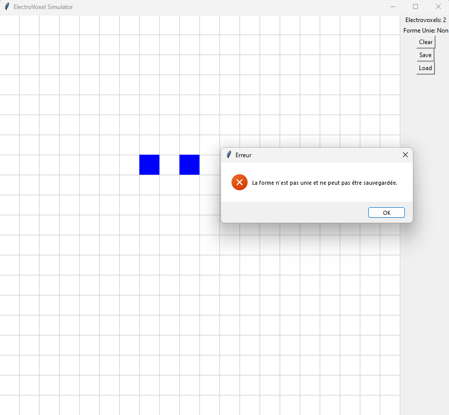

# MIT_ElectroVoxel

## Overview
MIT_ElectroVoxel is a simulation project developed based the subject of a internship at the European Space Agency's Advanced Concepts Team (ESA ACT). This project focuses on simulating electrovoxels, a novel concept emerging from MIT's CSAIL. The simulation aims to replicate the dynamic behaviors of electrovoxels in a 2D environment and includes an interactive interface for shape creation using electrovoxels.

The final objective is to use reinforcement learning to makes electrovoxels go to shape A to B.

## Features

### Electrovoxel Movement Simulation
- The `draft` folder contains the initial version of the electrovoxel environment.
- This environment encapsulates all the movements of electrovoxels, as showcased in the video located at `draft/media/Electrovoxel Simulation 2023-12-11 22-51-40.mp4`.

### Interactive Interface
- An interactive interface is included to facilitate the creation of shapes using electrovoxels.
- The interface can be viewed in the image.

### Rule Implementation
- A specific rule has been implemented to prevent the saving of shapes that consist of multiple, separate groups of electrovoxels.
- This rule is illustrated in the following image.

### Shape Import Functionality
- Within the `draft` directory, it is possible to import saved shapes in CSV format for display purposes (accessible only through code).

### Development of New Environment
- Work is underway in the `electrovoxel` directory to recreate the environment following the OpenAI framework.
- The development is inspired by OpenAI's gym, particularly the Frozen Lake example: [Frozen Lake Environment Source Code](https://github.com/openai/gym/blob/master/gym/envs/toy_text/frozen_lake.py#L185).

